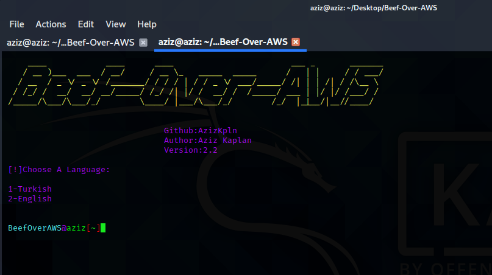

# Beef-Over-AWS
* Version:2.2

# 

# What IS Beef Over AWS/Beef Over AWS Nedir?

```
With default installation, you use beef on your local system.
In order to be able to use it anonymously and securly you have to use a reverse proxy software.
Beef-Over-AWS allows you to use 'Beef-XSS' over WAN securly and anonymously.

Varsayılan bir Beef kurulumu gerçekleştirdiğiniz zaman Beef'i local bilgisayarınızda kullanırsınız.
Beef'i WAN üzerinde anonim olarak ve güvenli bir şekilde kullanabilmek için bir reverse proxy yazılımı kullanmanız lazım.
Beef-Over-AWS size Beef aracını WAN üzerinden anonim bir şekilde ve güvenli olarak kullanabilmenizi sağlıyor. 

```

# USAGE/KULLANIM

> Please Watch The Video To Understand The Usage

> Kullanımını anlamak için videoyu izleyiniz

* https://www.youtube.com/watch?v=kxS_vuAg4js&t=351s


# Version 2.2

* Beef was running a bit slow. That issue has fixed.

* Sometimes ngrok was issuing "too many requests" error. That error has fixed.

* This tool was not working properly on ubuntu. Now, it works perfectly.


